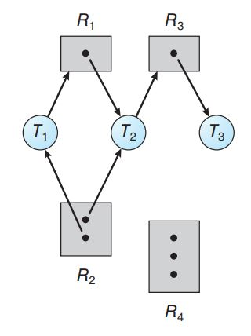

# Linux Admin 1

## Chapter 7 (Deadlocks)

### system model

- System has resources like : CPU cycles, memory locations, I/O devices, network and mutex locks.

- A set of threads is in a deadlocked state when every thread in the set is waiting for an event that can be caused only by another thread in the set. The events with which we are mainly concerned here are resource acquisition and release.

- A thread must request a resource before using it and must release the resource after using it.

- Under the normal mode of operation, a thread may utilize a resource in only the following sequence:
  - **Request** : The thread requests the resource. If the request cannot be granted immediately, then the requesting thread must wait until it can acquire the resource.
  - **Use** : The thread can operate on the resource (for example, if the resource is a mutex lock, the thread can access its critical section).
  - **Release** : The thread releases the resource.

- **A system table** : records whether each resource is free or allocated. It also records the thread to which it is allocated.

- **livelock** : similar to deadlock is both prevent proceeding, but in different reasons. Livelock occurs when a thread continuously attempts an action that fails.
  - Livelock typically occurs when threads retry failing operations at the same time.  It thus can generally be avoided by having each thread retry the failing operation at random times. (Like exponential backoff in ethernet so that avoid collision)

### deadlock characterization

- A deadlock situation can arise if the following four conditions hold simultaneously in a system.
  - **Mutual exclusion** : At least one resource must be held in a nonsharable mode; that is, only one thread at a time can use the resource. If another thread requests that resource, the requesting thread must be delayed until the resource has been released.
  - **Hold and wait** : A thread must be holding at least one resource and waiting to acquire additional resources that are currently being held by other threads.
  - **No preemption** : Resources cannot be preempted; that is, a resource can be released only voluntarily by the thread holding it, after that thread has completed its task.
  - **Circular wait** : A set {T~0~, T~1~, ..., T~n~} of waiting threads must exist such that T~0~ is waiting for a resource held by T~1~, T~1~ is waiting for a resource held by T~2~, ..., T~n−1~ is waiting for a resource held by T~n~, and T~n~ is waiting for a resource held by T~0~.

- The circular-wait condition implies the hold-and-wait condition, so the four conditions are not completely independent.

#### Resource-Allocation Graph

- This graph consists of a set of vertices V which represents threads T~i~ and resources R~i~ and a set of edges E which represents the relationship between threads and resources.
  - **Request edge** : A directed edge T~i~ → R~j~
  - **Assignment edge** : A directed edge R~i~ → T~j~
- number of instances in the resource are represented as dots.

- **Example**:-

- The sets T(Threads), R(Resources), and E(Edges)
  - T = {T~1~, T~2~, T~3~}
  - R = {R~1~, R~2~, R~3~, R~4~}
  - E = {T~1~ → R~1~, T~2~ → R~3~, R~1~ → T~2~, R~2~ → T~2~, R~2~ → T~1~, R~3~ → T~3~}

- If the graph contains *no cycles*, then *no* thread in the system is deadlocked.
- If the graph *does contain a cycle*, then a deadlock *may exist*.
- If each resource type has exactly *one instance*, then a cycle implies that *a deadlock has occurred*. (In this case, a cycle in the graph is both a necessary and a sufficient condition for the existence of deadlock.)
- If each resource type has *several instances*, then a cycle *does not necessarily imply that a deadlock has occurred*. (In this case, a cycle in the graph is a necessary but not a sufficient condition for the existence of deadlock.)

### pagging

## Chapter 8 (Main Memory)

### pagging
