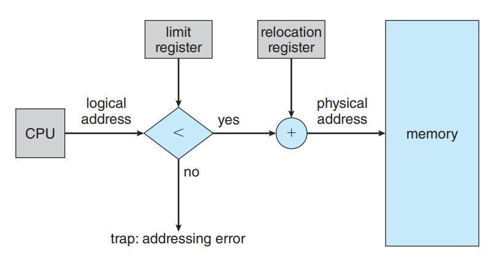
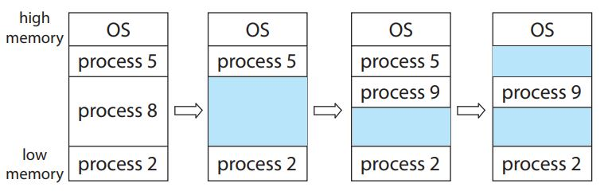

# Linux Admin 1

## Chapter 7 (Deadlocks)

### system model

- System has resources like : CPU cycles, memory locations, I/O devices, network and mutex locks.

- A set of threads is in a deadlocked state when every thread in the set is waiting for an event that can be caused only by another thread in the set. The events with which we are mainly concerned here are resource acquisition and release.

- A thread must request a resource before using it and must release the resource after using it.

- Under the normal mode of operation, a thread may utilize a resource in only the following sequence:
  - **Request** : The thread requests the resource. If the request cannot be granted immediately, then the requesting thread must wait until it can acquire the resource.
  - **Use** : The thread can operate on the resource (for example, if the resource is a mutex lock, the thread can access its critical section).
  - **Release** : The thread releases the resource.

- **A system table** : records whether each resource is free or allocated. It also records the thread to which it is allocated.

- **livelock** : similar to deadlock is both prevent proceeding, but in different reasons. Livelock occurs when a thread continuously attempts an action that fails.
  - Livelock typically occurs when threads retry failing operations at the same time.  It thus can generally be avoided by having each thread retry the failing operation at random times. (Like exponential backoff in ethernet so that avoid collision)

### deadlock characterization

- A deadlock situation can arise if the following four conditions hold simultaneously in a system.
  - **Mutual exclusion** : At least one resource must be held in a nonsharable mode; that is, only one thread at a time can use the resource. If another thread requests that resource, the requesting thread must be delayed until the resource has been released.
  - **Hold and wait** : A thread must be holding at least one resource and waiting to acquire additional resources that are currently being held by other threads.
  - **No preemption** : Resources cannot be preempted; that is, a resource can be released only voluntarily by the thread holding it, after that thread has completed its task.
  - **Circular wait** : A set {T~0~, T~1~, ..., T~n~} of waiting threads must exist such that T~0~ is waiting for a resource held by T~1~, T~1~ is waiting for a resource held by T~2~, ..., T~n−1~ is waiting for a resource held by T~n~, and T~n~ is waiting for a resource held by T~0~.

- The circular-wait condition implies the hold-and-wait condition, so the four conditions are not completely independent.

#### Resource-Allocation Graph

- This graph consists of a set of vertices V which represents threads T~i~ and resources R~i~ and a set of edges E which represents the relationship between threads and resources.
  - **Request edge** : A directed edge T~i~ → R~j~
  - **Assignment edge** : A directed edge R~i~ → T~j~
- number of instances in the resource are represented as dots.

- **Example**:-

- The sets T(Threads), R(Resources), and E(Edges)
  - T = {T~1~, T~2~, T~3~}
  - R = {R~1~, R~2~, R~3~, R~4~}
  - E = {T~1~ → R~1~, T~2~ → R~3~, R~1~ → T~2~, R~2~ → T~2~, R~2~ → T~1~, R~3~ → T~3~}

- If the graph contains *no cycles*, then *no* thread in the system is deadlocked.
- If the graph *does contain a cycle*, then a deadlock *may exist*.
- If each resource type has exactly *one instance*, then a cycle implies that *a deadlock has occurred*. (In this case, a cycle in the graph is both a necessary and a sufficient condition for the existence of deadlock.)
- If each resource type has *several instances*, then a cycle *does not necessarily imply that a deadlock has occurred*. (In this case, a cycle in the graph is a necessary but not a sufficient condition for the existence of deadlock.)

- ==Methods for Handling Deadlocks==
  - We can use a protocol to prevent or avoid deadlocks, ensuring that the system will never enter a deadlocked state.
    - **Deadlock prevention** : provides a set of methods to ensure that at least one of the necessary conditions cannot hold.
    - **Deadlock avoidance** : requires that the operating system be given additional information in advance concerning which resources a thread will request and use during its lifetime. With this additional knowledge, the operating system can decide for each request whether or not the thread should wait.
  - We can allow the system to enter a deadlocked state, detect it, and recover.
  - We can ignore the problem altogether and pretend that deadlocks never occur in the system.

### deadlock prevention

- By ensuring that at least one of these conditions cannot hold, we can *prevent* the occurrence of a deadlock.
- we will examine each condition seperately
  - **Mutual exclusion :-**
    - Sharable resources like (Read-Only files) do not require mutually exclusive access and thus cannot be involved in a deadlock
    - we cannot prevent deadlocks by denying the mutual-exclusion condition, because some resources are intrinsically nonsharable (like Mutex locks).
  - **Hold and Wait :-**
    - One protocol that we can use requires each thread to request and be allocated all its resources before it begins execution. (impracticle due to dynamic nature of requesting resources).
    - Alternatively, allows a thread to request resources only when it has none.
    - Both these protocols have two main disadvantages
      - **First**, resource utilization may be low, since resources may be allocated but unused for a long period.
      - **Second**, starvation is possible. A thread that needs several popular resources may have to wait indefinitely, because at least one of the resources that it needs is always allocated to some other thread.
  - **No Preemption :-**
    - one protocol is If a thread is holding some resources and requests another resource that cannot be immediately allocated to it, then all resources the thread is currently holding are preempted.
      - The preempted resources are added to the list of resources for which the thread is waiting.
    - Alternatively, if a thread requests some resources, we first check whether they are available. If they are, we allocate them. If they are not, we check whether they are allocated to some other thread that is waiting for additional resources. If so, we preempt the desired resources from the waiting thread and allocate them to the requesting thread. If the resources are neither available nor held by a waiting thread, the requesting thread must wait.
  - **Circular Wait:-**
    - presents an opportunity for a practical solution by invalidating one of the necessary conditions.
      - One way to ensure that this condition never holds is to impose a total ordering of all resource types and to require that each thread requests resources in an increasing order of enumeration.

***

## Chapter 8 (Main Memory)

### Contiguous Memory Allocation

- The memory is usually divided into **two partitions** : one for the **operating system** and one for the **user processes**.
- os can be in high or low memory addresses depending on the location of interrupt vector.
- In contiguous memory allocation, each process is contained in a single section of memory that is contiguous to the section containing the next process.

#### memory protection

- **The relocation (base) register** contains the value of the smallest physical address.
- **the limit register** contains the range of logical addresses
- The **MMU** maps the logical address dynamically by *adding* the value in the relocation register.
- When the CPU scheduler selects a process for execution, the dispatcher loads the relocation and limit registers with the correct values as part of the context switch.

#### Memory Allocation

- Operating system maintains information about:
  - allocated partitions
  - free partitions (hole)

- One of the simplest methods of allocating memory is to assign processes to variably sized partitions in memory.(block contains single process). => this is **variable partition scheme**.

- **variable partition scheme**
  - Initially, all memory is available for user processes and is considered one large block of available memory, **a hole**
  - When a process is allocated space, it is loaded into memory, where it can then compete for CPU time.
  - When a process terminates, it releases its memory, which the operating system may then provide to another process.

- If no memory can satisfy the demands of arriving processes there are 2 options :-
  - One option is to simply reject the process and provide an appropriate error message.
  - Alternatively, we can place such processes into a wait queue. When memory is later released, the operating system checks the wait queue to determine if it will satisfy the memory demands of a waiting process.

- the memory blocks available comprise a set of holes of various sizes scattered throughout memory.
  - When a process arrives and needs memory, the system searches the set for a hole that is large enough for this process.
  - If the hole is too large, it is split into **two parts**. One part is allocated to the *arriving process*; the other is *returned to the set of holes*.
  - When a process terminates, it releases its block of memory, which is then placed back in the set of holes.
  - If the new hole is adjacent to other holes, these adjacent holes are merged to form one larger hole.

- This procedure is a particular instance of **the general dynamic storage allocation problem**, which concerns how to satisfy a request of size n from a list of free holes.

- There are many solutions to this problem :-
  - **first-fit** : Allocate the first hole that is big enough. Searching can start either at the beginning of the set of holes or at the location where the previous first-fit search ended.
  - **best-fit** : Allocate the smallest hole that is big enough. We must search the entire list, unless the list is ordered by size.
  - **worst-fit** : Allocate the largest hole. Again, we must search the entire list, unless it is sorted by size.

#### fragmentation

- fragmentation can be **External Fragmentation** or **internal Fragmentation**
- **`External fragmentation`** exists when there is enough total memory space to satisfy a request but the available spaces are not contiguous: storage is fragmented into a large number of small holes.
- Both the first-fit and best-fit strategies for memory allocation suffer from external fragmentation.

- Statistical analysis of first fit, for instance, reveals that, even with some optimization, given N allocated blocks, another 0. N blocks will be lost to fragmentation. That is, *one-third* of memory may be unusable! This property is known as the **50-percent rule**.

- solution to **external fragmention** is `compaction` whose goal is to shuffle the memory contents so as to place all free memory together in one large block.
  - It is possible only if relocation (moving the program and data and then changing the base register to reflect the new base address.) is dynamic and is done at execution time.
- The simplest compaction algorithm is to move all processes toward one end of memory; all holes move in the other direction, producing one large hole of available memory. This scheme can be expensive.

- Another possible solution to the **external-fragmentation** problem is to permit the logical address space of processes to be concontiguous, thus allowing a process to be allocated physical memory wherever such memory is available.
  - this strategy is used in `paging`

- **`internal fragmentation`** exists when the allocated memory may be slightly larger than the requested, this size difference is memory internal to a partition, but not being used.

### pagging
